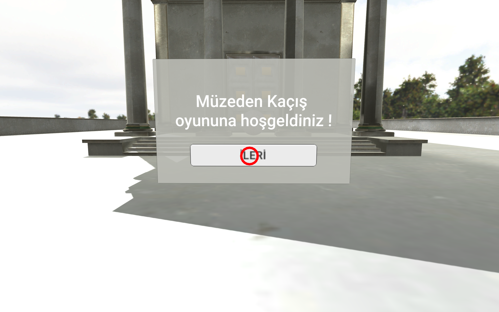
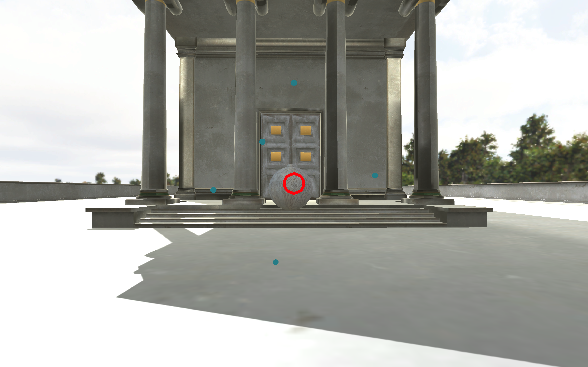

# Gazi Üniversitesi - Bilgisayar Bilimleri Yüksek Lisans Sanal Gerçeklik Vize ve Final Projesi
# NUR DESTEGÜL - 208010799

EscapeMuseumVR 
-------------------------------------------------------------------------------
Müzeden Kaçış oyunu bir müze ve içindeki tablolardaki ipuçlarını kullanarak sorulan sorulara doğru cevap verilmesi halinde müzeden kaçmayı amaçlar.

# Oynama
- W,A,S,D ile hareket edilip mouse'un sol tuşuyla seçme işlemi yapılabilir.
- Tabloların önündeki toplara basıldığında Player oraya gelir ve tablonun açıklaması okunur.
- Sorulan soruya yanlış cevap verilirse şık kırmızıya, doğru yanıt verilirse yeşile boyanır.
- Doğru cevaptan sonra bir sonraki sahneye geçilir. Oyun toplam 5 sahneden/ sorudan oluşur.
- Her sahnede farklı tablolar vardır. Son soru doğru cevaplandıktan sonra müzenin kapısı tekrar açılır.

# Ekran Çıktıları

# Referanslar
- Tablo açıklamalarını okutmak için https://soundoftext.com/ kullanıldı.
- Proje içindeki müze yapısı, tablolar ve imajlar internet kaynaklarından sağlandı.
- VR componentleri eklenmesine rağmen henüz test edilmediği için farklı bir kamera [eklendi](https://gist.github.com/gunderson/d7f096bd07874f31671306318019d996) . Bu kamera bize W,A,S,D harfleriyle hareket etmemizi sağlıyor.
- Script kullanımlarına [Unity](https://docs.unity3d.com/ScriptReference/) den bakıldı. Örnek kullanımlar için birçok YouTube ve diğer kaynaklardan yardım alındı.