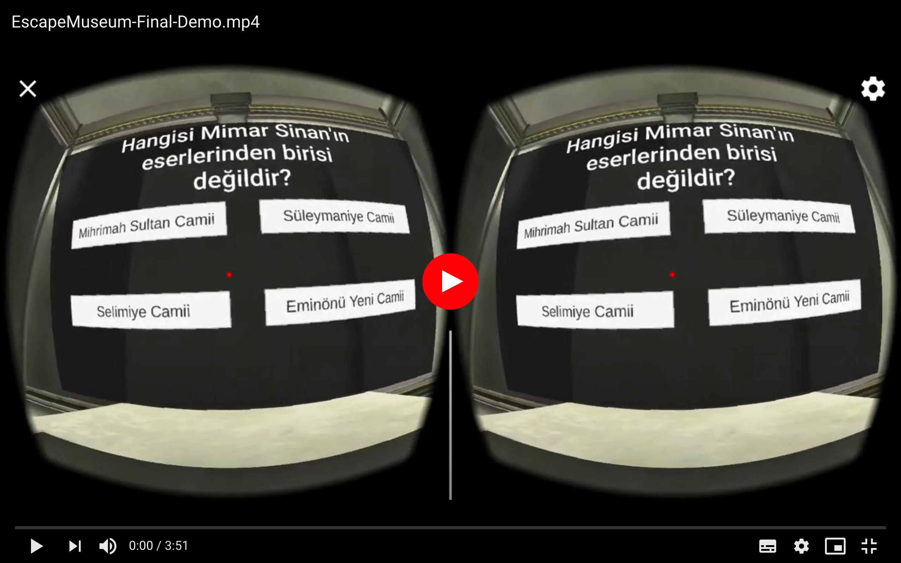
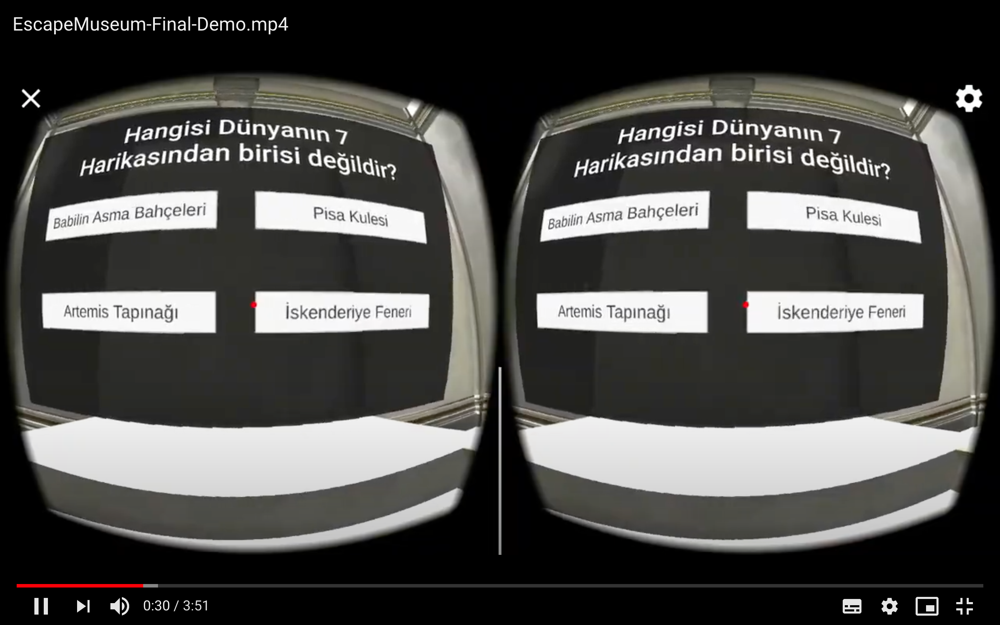
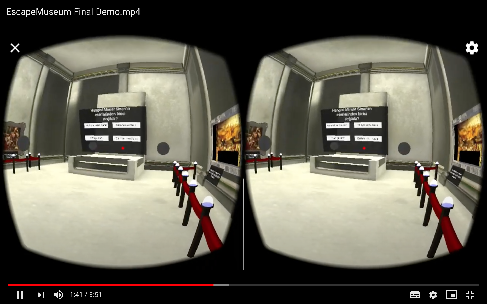
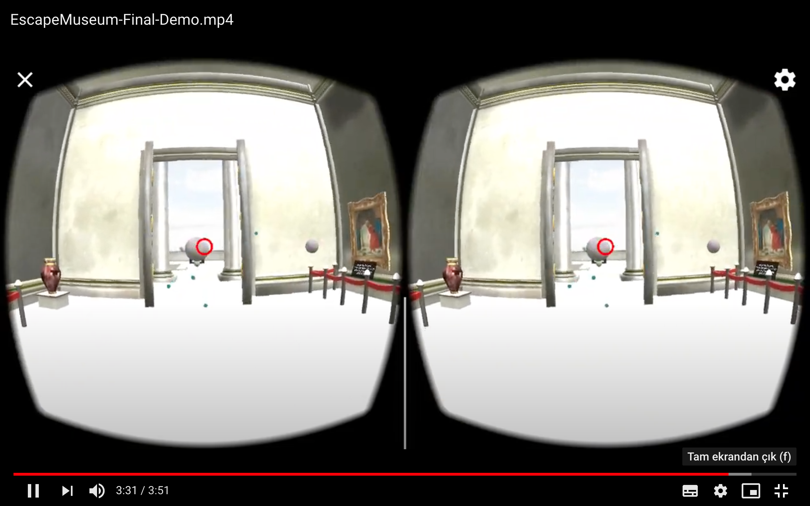
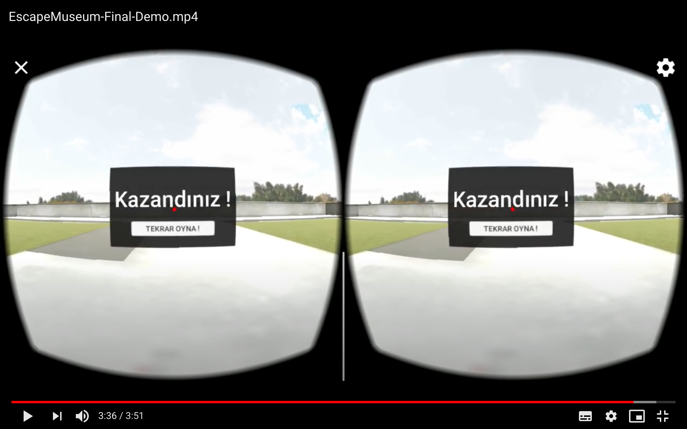

# Gazi Üniversitesi - Bilgisayar Bilimleri Yüksek Lisans Sanal Gerçeklik Final Projesi
# NUR DESTEGÜL - 208010799

EscapeMuseumFinal
-------------------------------------------------------------------------------
Müzeden Kaçış oyunu bir müze ve içindeki tablolardaki ipuçlarını kullanarak sorulan sorulara doğru cevap verilmesi halinde müzeden kaçmayı amaçlar. Toplam 5 sahnede 5 soru vardır. Her sahnede duvardaki tablolar, tablo seslendirmeleri değişmektedir. Ayrıca, bir sahneden diğer sahneye geçerken ışık azaltılır ve yeni sahneye geçme efekti verilir. 5.sorunun sonunda müze kapısı açılır ve oyuncu dışarı çıkabilir. Arzu edilirse "Tekrar Oyna" tuşuna basılarak baştan oynanabilir.

Not: Oyunu oynamak için Google Cardboard gibi Sanal Gerçeklik gözlüğüne ihtiyacınız vardır. Gözlük olmadan telefona kurarsanız, ellerinizle seçim yaparak da oynayabilirsiniz.

- Unity Versiyon: 2019.1.12f1
- GoogleVR SDK Versiyon: 1.60.0
- MacOs işletim sisteminde geliştirildi.
- Default ayarlar Android için ayarlandı. (Diğer platformlar için kaynak kod Unity ile açılıp, Target Platform değiştirilip tekrar Build edilmeli.)
- Android Min 4.4. sürümüne ihtiyaç duyar.

# Oyunun Kurulumu (Android)
- EscapeMuseum-Android.apk dosyası telefona indirilir.
- Android telefonumuzun uygulama çalıştırma ayarlarından tanınmamış uygulamaları çalıştırmaya izin verilir.
- Uygulamayı kurmak için APK dosyası tıklanır. Telefonumuz bize birkaç güvenlik sorusu soracaktır bunları kabul ettikten sonra oyunumuzu oynayabiliriz :)

# Oyun Dosyası ve Örnek Videosu
- Oyun dosyasına(EscapeMuseum-Android.apk) ve örnek videosuna [şuradan](https://drive.google.com/drive/folders/1TiLPgEQzBXiPgthUzlAeLMgSqUe5X5PP?usp=sharing) ulaşabilirsiniz.

# Ekran Çıktıları

# Referanslar
- Tablo açıklamalarını okutmak için https://soundoftext.com/ kullanıldı.
- Proje içindeki müze yapısı, tablolar ve imajlar internet kaynaklarından sağlandı.
- Script kullanımlarına [Unity](https://docs.unity3d.com/ScriptReference/) den bakıldı. Örnek kullanımlar için birçok YouTube ve diğer kaynaklardan yardım alındı.
- GoogleVR Cardboard eklenmesi için Youtube'dan bir çok video izlendi.